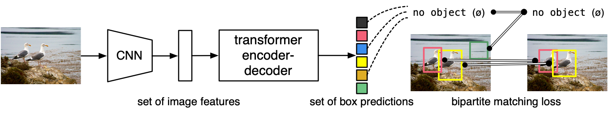

# Обнаружение объектов с помощью DETR (Detection Transformer)

_учебный проект группы 14 Программная инженерия_

#### Оглавление
- [Описание проекта](#описание-проекта)
- [Подготовка тестовых данных](#подготовка-тестовых-данных)
- [Требование к окружению](#требование-к-окружению)
- [Запуск и работа с проектом](#запуск-и-работа-с-проектом)
- [Пример как работает программа](#пример-как-работает-программа)
- [Issues](#issues)
- [Глоссарий](#глоссарий)
- [Источники](#источники)
- [Авторы](#авторы)


### Описание проекта

Проект на основе предварительно обученных моделей и метода DETR (DEtection TRansformer)[1].

В конвеере (pipline) обнаружения объектов участвуют Transformer, матчинг Faster R-CNN с ResNet-50, получение 45 AP из COCO, при этом используя вдвое меньшую вычислительную мощность (FLOPs) и то же количество параметров.




### Подготовка тестовых данных

Тестовые данные для первичного запуска проекта расположены в директории проекта `originals`.

Большая часть тестовых изображений получены из ресурса [cocodataset.org](https://cocodataset.org/), а так же из разных источников в интернете.

Демонстрационная модель поддерживает только изображения до 1600 пикселей на каждой стороне.


### Требование к окружению

- Интерпретатор Python не ниже 3.8
- программа для просмотра изображений (jpg)
- подключение к интернету
- OS Ubuntu 20+ (прим: на Mac OS и Windows не тестировалось)

### Запуск и работа с проектом

Перед запуском кода необходимо установить зависимости:

```bash
pip install torch
pip inctall matplotlib
pip install timm
```

Помещаем тестовые изображения формата jpg, png в директорий originals
и запускаем проект командой

```bash
python3 main.py
```

Обработанные изображения можно найти в директории проекта `export`.

### Пример как работает программа

Пример 1.

Оригинальное изображение:


Обработанное изображение:


----

Пример 2.

Оригинальное изображение:


Обработанное изображение:


### Issues

Мы используем GitHub issues для отслеживания ошибок. Пожалуйста, убедитесь, что ваше описание понятно и содержит достаточные инструкции для воспроизведения проблемы.

### Глоссарий

- COCO (Common Objects in Context) - это большой набор данных для решения задач распознавания объектов, сегментации и субтитров. [cocodataset.org](https://cocodataset.org/)
- PyTorch - фреймворк машинного обучения для языка Python с открытым исходным кодом, созданный на базе [Torch](https://ru.wikipedia.org/wiki/Torch).
-  AP (Average Precision) - это популярная метрика измерения точности детекторов объектов таких как Faster R-CNN, SSD и т.д. Average Precision вычисляет среднюю точность для recall в диапазоне от 0 до 1.


### Источники

1. [оф. страница проекта DETR на github: End-to-End Object Detection with Transformers](https://github.com/facebookresearch/detr)
2. [Пример на Google colab](https://colab.research.google.com/github/facebookresearch/detr/blob/colab/notebooks/detr_demo.ipynb#scrollTo=Jf59UNQ37QhJ)
3. [Статья на Хабре: Тихая революция и новый дикий запад в ComputerVisio ](https://habr.com/ru/company/recognitor/blog/553478/)
4. [Wiki: Transformer](https://en.wikipedia.org/wiki/Transformer_(machine_learning_model)), ([на русском](https://ru.wikipedia.org/wiki/%D0%A2%D1%80%D0%B0%D0%BD%D1%81%D1%84%D0%BE%D1%80%D0%BC%D0%B5%D1%80_(%D0%BC%D0%BE%D0%B4%D0%B5%D0%BB%D1%8C_%D0%BC%D0%B0%D1%88%D0%B8%D0%BD%D0%BD%D0%BE%D0%B3%D0%BE_%D0%BE%D0%B1%D1%83%D1%87%D0%B5%D0%BD%D0%B8%D1%8F)))
5. [DETR notebooks](https://github.com/NielsRogge/Transformers-Tutorials/tree/master/DETR)
6. [huggingface.co: Про DETR](https://huggingface.co/docs/transformers/model_doc/detr)
7. [Статья End-to-End Object Detection with Transformers](https://arxiv.org/abs/2005.12872)

### Авторы
Искужин И., Акинин Дмитрий, Ахметов Вадим
студенты 1 курса магистратуры "Инженерия машинного обучения" УрФУ.

ноябрь, 2022 год.
