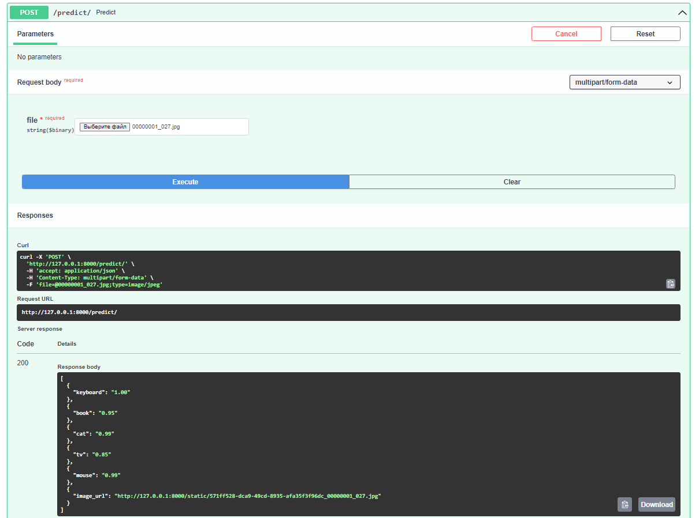

# Обнаружение объектов с помощью DETR (Detection Transformer)

_учебный проект группы 14 Программная инженерия_

#### Оглавление
- [Цель проекта](#цель-проекта)
- [Описание проекта](#описание-проекта)
- [Подготовка тестовых данных](#подготовка-тестовых-данных)
- [Требование к окружению](#требование-к-окружению)
- [Запуск проекта](#запуск-проекта)
- [Запуск тестов](#запуск-тестов)
- [Запуск проекта в докере (для деплоя)](#запуск-проекта-в-докере-для-деплоя)
- [Работа с проектом](#работа-с-проектом)
- [Пример как работает программа](#пример-как-работает-программа)
- [Issues](#issues)
- [Глоссарий](#глоссарий)
- [Источники](#источники)
- [Обновление](#обновление)
- [Авторы](#авторы)


### Цель проекта

Разработать Web или API приложение машинного обучения и развернуть его в облаке.

### Описание проекта

Проект на основе предварительно обученных моделей и метода DETR (DEtection TRansformer)[1].

В конвеере (pipeline) обнаружения объектов участвуют Transformer, матчинг Faster R-CNN с ResNet-50, получение 45 AP из COCO, при этом используя вдвое меньшую вычислительную мощность (FLOPs) и то же количество параметров.


### Подготовка тестовых данных

Тестовые данные для тестирования проекта расположены в директории проекта `originals`.

Большая часть тестовых изображений получены из ресурса [cocodataset.org](https://cocodataset.org/), а так же из разных источников в интернете.

Демонстрационная модель поддерживает только изображения до 1600 пикселей на каждой стороне.

### Требование к окружению

- Интерпретатор Python не ниже 3.8
- программа для просмотра изображений (jpg)
- подключение к интернету
- OS Ubuntu 20+ или Windows(IDE: PyCharm)

### Запуск проекта

В файл `.env` в корне директории проекта прописать домен и порт (файл `.env` не указываем в `.gitignore`, т.к. учебный проект):
```commandline
PORT=8000
DOMAIN='http://127.0.0.1'
BASE_URL=${DOMAIN}:${PORT}
```

Перед запуском кода необходимо установить зависимости указанные в requirements.txt:

```bash
pip install -r requirements.txt
```

При необходимости, обновить библиотеку Pillow:
```
python3 -m pip install --upgrade pip
python3 -m pip install --upgrade Pillow
```

_Примечание: Требуется PIL версии не ниже 8.0.0_


Запускаем проект командой
```bash
# находясь в директории проекта запустить проект
uvicorn myapi:app
```
### Запуск тестов

Запуск тестов производится с помощью команды pytest в каталоге с приложением

```
pytest

```

### Запуск проекта в докере (для деплоя)

Для удобства развертывания добавили Dockerfile

Можно запустить таким образом (примерчание: при запуске проекта в докер-контейнере отдельная установка зависимостей из requirements.txt не требуется):

```bash
docker build -t detr .
docker run -dit -p 8080:8080 --restart unless-stopped detr
```
Приложение будет доступно на порту 8080.

### Работа с проектом
1. Открываем в браузере адрес:
```
{base_url}/docs 
```

Выбираем метод "POST" и в теле загружаем кнопкой "Выберите файл" тестовые изображения формата jpg, png и нажимаем на кнопку "Execute".

В формате Json отобразятся в распознанные объекты и ссылка на распознанное изображение

2. Тестирование с помощью Postman или Insomnia: 

Отправляем POST запрос по адресу `{base_url}/predict`:
- в разделе BODY выбираем form-data (или Multipart Form для Insomnia)
- в поле key (value для Insomnia) выбираем File
- в поле key указываем значение `file`, в поле value выбираем файл (jpg, png) из директории ПК 
- отправляем запрос кнопкой SEND

3. Если перейти по адресу из json-ответа, то можно посмотреть результат обработки (пример ниже)

_При разворачивании проекта на локальном ПК, base_url обычно http://127.0.0.1:8000_

### Пример как работает программа


---

---


### Issues

Мы используем GitHub issues для отслеживания ошибок. Пожалуйста, убедитесь, что ваше описание понятно и содержит достаточные инструкции для воспроизведения проблемы.

### Глоссарий

- COCO (Common Objects in Context) - это большой набор данных для решения задач распознавания объектов, сегментации и субтитров. [cocodataset.org](https://cocodataset.org/)
- PyTorch - фреймворк машинного обучения для языка Python с открытым исходным кодом, созданный на базе [Torch](https://ru.wikipedia.org/wiki/Torch).
-  AP (Average Precision) - это популярная метрика измерения точности детекторов объектов таких как Faster R-CNN, SSD и т.д. Average Precision вычисляет среднюю точность для recall в диапазоне от 0 до 1.


### Источники

1. [оф. страница проекта DETR на github: End-to-End Object Detection with Transformers](https://github.com/facebookresearch/detr)
2. [Пример на Google colab](https://colab.research.google.com/github/facebookresearch/detr/blob/colab/notebooks/detr_demo.ipynb#scrollTo=Jf59UNQ37QhJ)
3. [Статья на Хабре: Тихая революция и новый дикий запад в ComputerVisio ](https://habr.com/ru/company/recognitor/blog/553478/)
4. [Wiki: Transformer](https://en.wikipedia.org/wiki/Transformer_(machine_learning_model)), ([на русском](https://ru.wikipedia.org/wiki/%D0%A2%D1%80%D0%B0%D0%BD%D1%81%D1%84%D0%BE%D1%80%D0%BC%D0%B5%D1%80_(%D0%BC%D0%BE%D0%B4%D0%B5%D0%BB%D1%8C_%D0%BC%D0%B0%D1%88%D0%B8%D0%BD%D0%BD%D0%BE%D0%B3%D0%BE_%D0%BE%D0%B1%D1%83%D1%87%D0%B5%D0%BD%D0%B8%D1%8F)))
5. [DETR notebooks](https://github.com/NielsRogge/Transformers-Tutorials/tree/master/DETR)
6. [huggingface.co: Про DETR](https://huggingface.co/docs/transformers/model_doc/detr)
7. [Статья End-to-End Object Detection with Transformers](https://arxiv.org/abs/2005.12872)
8. [FastAPI](https://fastapi.tiangolo.com/)

### Обновление
- Заменили библиотеку matplotlib на PIL
- Добавили поддержку API

### Авторы
- [Искужин И.Р.](https://github.com/Lemeri02)
- [Акинин Дмитрий В.](https://github.com/AkininD)
- [Ахметов Вадим М.](https://github.com/vadim328)


студенты 1 курса магистратуры "Инженерия машинного обучения" УрФУ.

Декабрь, 2022 год.
